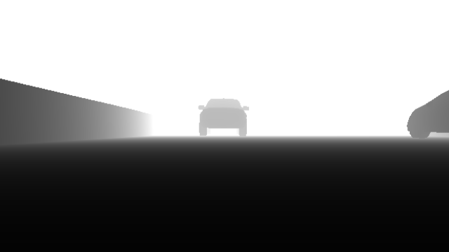
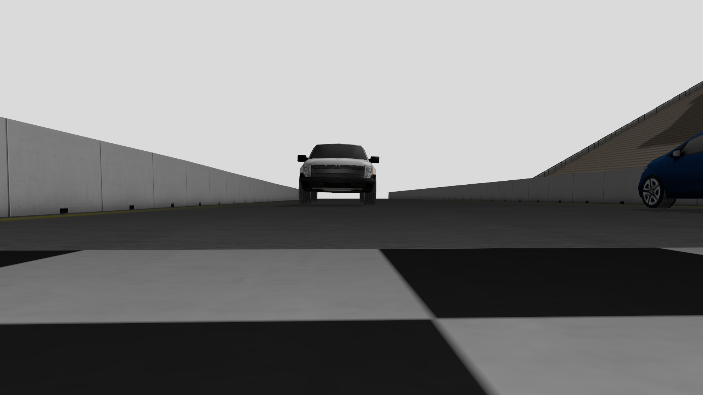
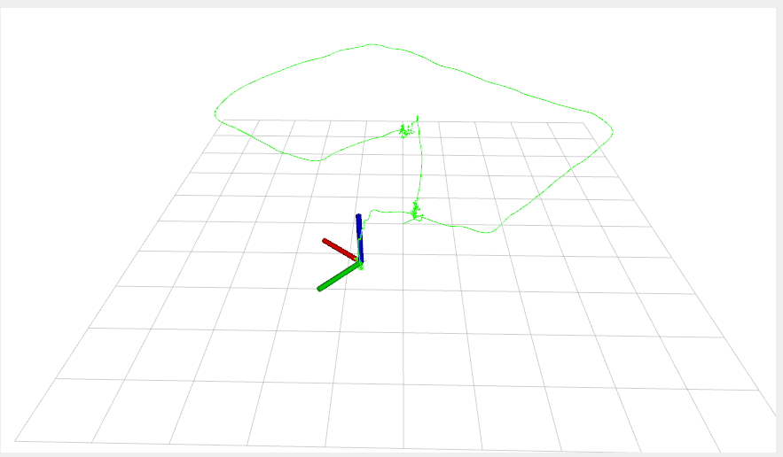

# hunter-killer-drone
Firmware and simulation of a hunter killer drone

Dependencies
- ROS 2 Humble
- PX4
- Micro XRCE-DDS Agent
- OpenCV
- Ultralytics YOLOv8
- ros_gz

## Results
### Depth Camera

### Camera

### RViz Path Visualization

### AI Tracking and Drone Control
https://github.com/TelevisionNinja/hunter-killer-drone/assets/41529985/9603c2c8-03e6-4fad-9373-9c04c8ed0ef4

## Installation

Clone the repo
```bash
git clone https://github.com/TelevisionNinja/hunter-killer-drone.git
```

Go to the scripts folder and make everything executable
```bash
cd ./hunter-killer-drone/scripts
chmod +x *
```

Setup Ubuntu
```bash
./ubuntuSetup.sh
```

Build the repo
```bash
./build.sh
```

Launch the simulation
```bash
./launch.sh
```

## Controls

W: Pitch Up<br/>
S: Pitch Down<br/>
A: Yaw Left<br/>
D: Yaw Right<br/>
Q: Up<br/>
E: Down<br/>

Up Arrow: Move Forward<br/>
Down Arrow: Move Backward<br/>
Left Arrow: Move Left<br/>
Right Arrow: Move Right<br/>

SPACE: Arm/disarm the drone<br/>
R: Enable AI tracking
